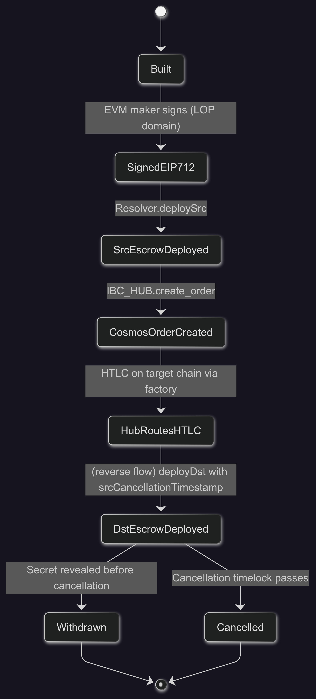

# CosmosFusionPlus
Implementation of Fusion+ cross chain swap between evm &amp; any cosmos chain 

### Current Implementaion (NOT Funcional) 

Fusion+ implementation for Arbitrum (EVM) - Osmosis (Cosmos) cross chain swap (not fully functional). UI is deployed [here](https://cosmos-fusion-plus-57e3.vercel.app/) --not connected with backend.

### Future Plans

I've initial draft of IBC v2 ready under `./futurePlans` dir. I'll be focusing on integrating hub & spoke contracts.

